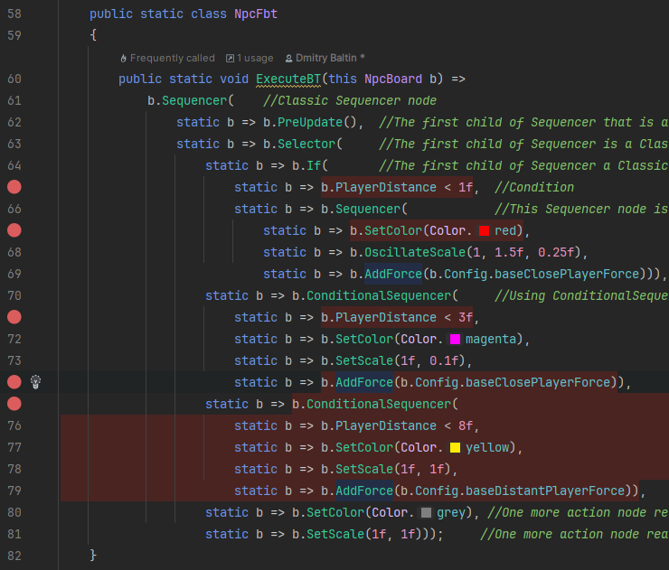

# "Functional Behavior Tree" Design Pattern in C#

Functional-style behavior tree in C#/Unity: simple, fast, debug-friendly, and memory-efficient behavior tree in C#/Unity.

# Overview

## Key Features

1. **Clear and Concise Behavior Tree Definition**  
   Behavior trees are defined directly in code using functions calls and lambda expressions, resulting in clear and compact logic.

2. **Ease Debug**  
   The tree definition and execution code are the same, which means you can place breakpoints inside code fragments, and they will behave as expected.
   No special complex "behaviour tree debugger" is required, you will use your favorite C# IDE.

3. **Zero memory allocation**  
   No memory is allocated for the tree structure because it is embedded directly into the code.  
   No memory is allocated for delegate instances, thanks to the use of static anonymous delegates.  
   No memory is allocated to transfer arguments to functions due to the use functions with predefined argument sets (in earlier versions of C#) or 'params Collection' arguments (in C# 13) instead of 'params arrays'.

4. **High speed**  
   No expensive features are used (e.g., garbage collection, hash tables, closures, etc.).  
   The implementation relies solely on function invocations, static delegates, conditional expressions, and loops.
  
5. **Minimal and highly readable code**  
   The entire codebase consists of just a few .cs files, totaling a few hundred lines.

## Usage Example

This example shows a simple behavior tree for an NPC on a 2D surface that can idle, approach the player, and attack.

```csharp
    public static class NpcFbt
    {
        public static void ExecuteBT(this NpcBoard b) =>
            b.Sequencer(    //Classic Sequencer node
                static b => b.PreUpdate(),  //The first child of Sequencer realized as a delegate Func<NpcBoard, Status> 
                static b => b.Selector(     //The decond child of Sequencer is a Classic Selector node
                    static b => b.If(       //The first child of Selector a Classic Conditional node 
                        static b => b.PlayerDistance < 1f,  //Condition
                        static b => b.Sequencer(            //This Sequencer node is executed when the condition is true 
                            static b => b.SetColor(Color.red),
                            static b => b.OscillateScale(1, 1.5f, 0.25f),
                            static b => b.AddForce(b.Config.baseClosePlayerForce))),
                    static b => b.ConditionalSequencer(     //Using ConditionalSequencer instead of If + Sequencer (see above)   
                        static b => b.PlayerDistance < 3f,
                        static b => b.SetColor(Color.magenta),
                        static b => b.SetScale(1f, 0.1f),
                        static b => b.AddForce(b.Config.baseClosePlayerForce)),
                    static b => b.ConditionalSequencer(         
                        static b => b.PlayerDistance < 8f,
                        static b => b.SetColor(Color.yellow),
                        static b => b.SetScale(1f, 1f),
                        static b => b.AddForce(b.Config.baseDistantPlayerForce)),
                    static b => b.SetColor(Color.grey),
                    static b => b.SetScale(1f, 1f)));   
    }
```
Key points to note:  
1. **Classes**
   1. **NpcFbt** is a custom class implementing NPC behavior tree. It is static and contains the only one extension function ExecuteBT().
   1. **NpcBoard** is a custom **blackboard** class created by the user that contains the data and methods related to NPC. **NpcBoard** instance is stored in an external container (e.g., a MonoBehaviour in Unity), which calls **NpcBoard.Execute()** during the update cycle.
1. **Methods**
   1. **Action()**, **Sequencer()**, **Selector()**, and **ConditionalAction()** are extensions methods from this library, implementing different nodes.
   1. **b.AddForce()**, **b.SetColor()**, **b.SetScale()**, and **b.PreUpdate()** are defined by the user.

This implementation is simple, zero allocation and fast and focused purely on logic, making it easy to debug.
1. **Zero memory allocation**
   1. **static** modifier before anonymous delegates guarantee avoiding closures, therefore no memory allocation required for every delegates call. Every lambda function uses the only a single internal variable, **b**, and there are no closures here.
   1. Functions with multiple arguments (**Selector**, **Sequence**, etc) avoid using **params arrays** definition that's why no memory allocated for these calls.
2. You can set breakpoints on any anonymous delegate or tree node function. When the execution reaches these breakpoints, the debugger will pause correctly, allowing you to inspect the state at that point.



For detailed examples of using Functional Behavior Tree (FBT), see the [FBT Example repository](https://github.com/dmitrybaltin/FbtExample), which contains ready-to-run projects demonstrating common use cases.

## How does it work

1. As usual, a special Status object is used as the return value for each node.
```csharp
    public enum Status
    {
        Success = 0,
        Failure = 1,
        Running = 2,
    }
```

2. Every node is realized as a static extension function but not a class.  
   For example here is a full code of a  Selector node:
```csharp
     public static Status Selector<T>(this T board,
         Func<T, Status> f1,
         Func<T, Status> f2,
         Func<T, Status> f3 = null,
         Func<T, Status> f4 = null,
         Func<T, Status> f5 = null,
         Func<T, Status> f6 = null,
         Func<T, Status> f7 = null,
         Func<T, Status> f8 = null)
     {
         var s = f1?.Invoke(board) ?? Status.Failure; if (s is Status.Running or Status.Success) return s;
         s = f2?.Invoke(board) ?? Status.Failure; if (s is Status.Running or Status.Success) return s;
         s = f3?.Invoke(board) ?? Status.Failure; if (s is Status.Running or Status.Success) return s;
         s = f4?.Invoke(board) ?? Status.Failure; if (s is Status.Running or Status.Success) return s;
         s = f5?.Invoke(board) ?? Status.Failure; if (s is Status.Running or Status.Success) return s;
         s = f6?.Invoke(board) ?? Status.Failure; if (s is Status.Running or Status.Success) return s;
         s = f7?.Invoke(board) ?? Status.Failure; if (s is Status.Running or Status.Success) return s;
         s = f8?.Invoke(board) ?? Status.Failure; if (s is Status.Running or Status.Success) return s;

         return s;
     }
```

3. Action nodes require no implementation; any `Func<T, Status>` delegate can serve as an action node. For example:
```csharp
     public Status AddForce(float playerForce)
     {
         var force = (_playerWorldPos - _body.worldCenterOfMass) * (playerForce * Time.deltaTime);
         _body.AddForce(force, ForceMode.VelocityChange);
         return Status.Success;
     }
```
    
## Installation

You can install Functional Behavior Tree (FBT) in Unity using one of the following methods:

### 1. Install from GitHub as a Unity Package
1. Open your Unity project.
1. Go to **Window → Package Manager**.
1. Click the **+** button in the top-left corner and choose **Add package from git URL...**.
1. Enter the URL: https://github.com/dmitrybaltin/FunctionalBT.git
1. Click **Add**. The package will be imported into your project.

### 2. Install via OpenUPM

1. Open your Unity project.
2. Go to **Edit → Project Settings → Package Manager → Scoped Registries**
3. Add a new registry for OpenUPM:
   - **Name:** OpenUPM
   - **URL:** `https://package.openupm.com`
   - **Scopes:** `com.baltin`
4. Open the **Package Manager** (`Window → Package Manager`).
5. Click **+ → Add package from git URL...** (or search in the registry if the package appears) and enter: **com.baltin.fbt**

### 3. Install as a Git Submodule

1. Navigate to your Unity project folder in a terminal.
1. Run
```
git submodule add https://github.com/dmitrybaltin/FunctionalBT.git Packages/FunctionalBT
git submodule update --init --recursive
```

## Requirements
C# 9 (Unity 2021.2 and later) is required because of using static anonymous delegates.

# Functional Behavior Tree Philosophy

This section explains the design philosophy, implementation details, and optimizations behind the Functional Behavior Tree (BT) library. It also highlights key constraints, the reasoning behind chosen approaches, and solutions to specific challenges.

## Why does it created

There are many different implementations of Behavior Trees in Unity. Typically, they include a node editor, a large set of nodes, some debugging tools, and a lot of internal service code whose efficiency is hard to assess. Debugging is often a major challenge.

There are also some implementations in C#, such as [Fluid Behavior Tree](https://github.com/ashblue/fluid-behavior-tree), but they have some drawbacks. In particular, debugging can be difficult (requiring a special debugger), the codebase is quite heavy, unnecessary memory allocations occur, and the code is not very compact.

**Functional Behavior Tree is a simple software design pattern that offers the following approach**.

- Instead of a node editor, you define the behavior tree inside C# using simplest and clear syntax.
- Instead of a using heavy libraries with ton of internal code, you use a thin simple pattern that is absolutely transparent for you.
- Instead of a specialized debugger, you use C# debugger inside you favorite IDE.

## Initial Constraints

The library was designed with the following limitations in mind:

1. **Classic Behavior Tree Execution:**
   - Implements a traditional behavior tree that executes completely during each game loop cycle, rather than adopting an event-driven approach.

2. **Code-Only Implementation:**
   - Focuses solely on C# code, avoiding the need for visual editors (e.g., Behavior Designer) or custom languages (e.g., PandaBT).

3. **Separation of Concerns:**
   - The behavior tree and the managed object (commonly referred to as the Blackboard) are treated as separate entities. Nodes operate on the Blackboard shared across all nodes within the same tree instance.

## Behavior Trees: A Functional Approach

Many different implementations of Behaviour Trees in Unity involve a node editor, a large set of nodes, a runtime system, and debugging tools, along with a lot of internal service code whose efficiency is often uncertain. However, most of these implementations treat the tree as a graph, which leads to unnecessarily complex designs, where nodes are represented as objects requiring individual classes and intricate visual editors. As a result, debugging becomes challenging due to the separation of node creation and execution across various parts of the codebase, making specialized tools necessary.

### The Functional Alternative

To truly understand the Behaviour Tree, we should think of it as a function, not a graph.

Indeed, each node in the BT is a function (not an object!), with multiple inputs and a single output, and it doesn’t require memory (there is no need to store any state between function calls). Therefore, the tree as a whole, or any of its subtrees, is also a function that calls the functions of its child nodes.

In this library:

- **Nodes are functions, not objects:**
  - Each node is a function with multiple inputs and one output, avoiding the need for memory allocation.

- **Tree as a recursive function:**
  - The behavior tree is a recursive function that calls nested node functions.

- **Simplified debugging:**
  - Functional programming principles ensure clarity, making code easy to debug using standard IDE tools.

This approach results in clean, readable, and efficient code with minimal boilerplate, all while being fast and memory-efficient.

# Functional Behavior Tree pattern code for Unity

Below is a full implementation of the Functional Behavior Tree pattern, including all the classic nodes (**Selector**, **Sequencer**, **Conditional**, and **Inverter**) and the required supporting code: the **Status** enum and a couple of extension methods for it.  
In total, the code is just over 100 lines, including comments.  
You can also find the same code in the file [LightestFBT.cs](src/LightestFBT.cs).

The main point here is an **each node is a static function rather than an object**. That's why the code is minimal and contains the core logic only:
1. Every node - is the only static function, containing the required logic.
1. Different boilerplate services code (for example class constructior) is not required. 
1. No code for **Action** node is required because an every static delegates **Func<T, Status>** can be used as an **Action** node.

```csharp
#if !NET9_0_OR_GREATER
    public enum Status
    {
        Success = 0,
        Failure = 1,
        Running = 2,
    }

    public static class StatusExtensions
    {
        /// <summary>
        /// Invert Status
        /// </summary>
        /// <param name="status">Source status to invert</param>
        /// <returns></returns>
        [MethodImpl(MethodImplOptions.AggressiveInlining)]
        public static Status Invert(this Status status)
        {
            return status switch
            {
                Status.Failure => Status.Success,
                Status.Success => Status.Failure,
                _ => Status.Running,
            };
        }

        [MethodImpl(MethodImplOptions.AggressiveInlining)]
        public static Status ToStatus(this bool value) => 
            value ? Status.Success : Status.Failure;
    }
    
    public class LightestFbt<T>
    {
        /// <summary>
        /// Classic inverter node
        /// </summary>
        /// <param name="board">Blackboard object</param>
        /// <param name="func">Delegate receiving T and returning Status</param>
        /// <returns></returns>
        [MethodImpl(MethodImplOptions.AggressiveInlining)]
        public static Status Inverter(T board, Func<T, Status> func)
            => func.Invoke(board).Invert();
        
        /// <summary>
        /// Execute the given func delegate if the given condition is true 
        /// </summary>
        /// <param name="board">Blackboard object</param>
        /// <param name="condition">Condition given as a delegate returning true</param>
        /// <param name="func">Action to execute if condition is true. Delegates receiving T and returning Status</param>
        /// <returns></returns>
        [MethodImpl(MethodImplOptions.AggressiveInlining)]
        public static Status If(T board, Func<T, bool> condition, Func<T, Status> func) 
            => condition.Invoke(board) ? func.Invoke(board): Status.Failure;

        /// <summary>
        /// Classic selector node
        /// </summary>
        [MethodImpl(MethodImplOptions.AggressiveInlining)]
        public static Status Selector(T board,
            Func<T, Status> f1,
            Func<T, Status> f2,
            Func<T, Status> f3 = null,
            Func<T, Status> f4 = null,
            Func<T, Status> f5 = null,
            Func<T, Status> f6 = null,
            Func<T, Status> f7 = null,
            Func<T, Status> f8 = null)
        {
            var s = f1?.Invoke(board) ?? Status.Failure; if (s is Status.Running or Status.Success) return s;
            s = f2?.Invoke(board) ?? Status.Failure; if (s is Status.Running or Status.Success) return s;
            s = f3?.Invoke(board) ?? Status.Failure; if (s is Status.Running or Status.Success) return s;
            s = f4?.Invoke(board) ?? Status.Failure; if (s is Status.Running or Status.Success) return s;
            s = f5?.Invoke(board) ?? Status.Failure; if (s is Status.Running or Status.Success) return s;
            s = f6?.Invoke(board) ?? Status.Failure; if (s is Status.Running or Status.Success) return s;
            s = f7?.Invoke(board) ?? Status.Failure; if (s is Status.Running or Status.Success) return s;
            s = f8?.Invoke(board) ?? Status.Failure; if (s is Status.Running or Status.Success) return s;

            return s;
        }
        
        /// <summary>
        /// Classic sequencer node
        /// </summary>
        /// <param name="board">Blackboard object</param>
        [MethodImpl(MethodImplOptions.AggressiveInlining)]
        public static Status Sequencer(T board,
            Func<T, Status> f1,
            Func<T, Status> f2,
            Func<T, Status> f3 = null,
            Func<T, Status> f4 = null,
            Func<T, Status> f5 = null,
            Func<T, Status> f6 = null,
            Func<T, Status> f7 = null,
            Func<T, Status> f8 = null)
        {
            var s = f1?.Invoke(board) ?? Status.Success; if (s is Status.Running or Status.Failure) return s;
            s = f2?.Invoke(board) ?? Status.Success; if (s is Status.Running or Status.Failure) return s;
            s = f3?.Invoke(board) ?? Status.Success; if (s is Status.Running or Status.Failure) return s;
            s = f4?.Invoke(board) ?? Status.Success; if (s is Status.Running or Status.Failure) return s;
            s = f5?.Invoke(board) ?? Status.Success; if (s is Status.Running or Status.Failure) return s;
            s = f6?.Invoke(board) ?? Status.Success; if (s is Status.Running or Status.Failure) return s;
            s = f7?.Invoke(board) ?? Status.Success; if (s is Status.Running or Status.Failure) return s;
            s = f8?.Invoke(board) ?? Status.Success; if (s is Status.Running or Status.Failure) return s;

            return s;
        }
#endif
```

There is one peculiar detail here: the Selector and Sequencer functions are implemented with multiple arguments that have default values, effectively functioning as variadic functions, instead of using the classic params arrays.

This choice is intentional, not a bug. The params arrays feature is not memory-efficient because it creates a new array on the heap each time the function is executed.

The downside of the chosen method is the limited maximum number of child nodes (8). However, this is not a significant issue.
This number (8) was chosen based on practical experience and is almost always sufficient for behavior tree logic.
If more child nodes are needed, there are two simple solutions:

1. Place several nodes hierarchically, one on top of the other. Each additional "level" in this hierarchy exponentially increases the number of child nodes.
1. Modify the Sequencer and Selector functions to add more input arguments (this takes about 10 minutes of coding).

## Functional Behavior Tree pattern code for C#13 (not for Unity)

C# 13 introduces a new efficient way to avoid memory allocation in variadic functions, called *params Collections*.

Below is an implementation of Selector() and Sequencer() using this new feature. As you can see, I used ReadOnlySpan instead of a traditional params array. 
This approach completely avoids dynamic memory allocation when calling these functions.   
For more details, see the official documentation on [params collections](https://learn.microsoft.com/en-us/dotnet/csharp/language-reference/proposals/csharp-13.0/params-collections).

```csharp
#if NET9_0_OR_GREATER
        /// <summary>
        /// Classic selector node
        /// </summary>
        /// <param name="board">Blackboard object</param>
        /// <param name="funcs">Actions returning Status</param>
        /// <returns></returns>
        [MethodImpl(MethodImplOptions.AggressiveInlining)]
        public static Status Selector(T board, 
            params ReadOnlySpan<Func<T, Status>> funcs
            )
        {
            foreach (var f in funcs)
            {
                var childStatus = f?.Invoke(board) ?? Status.Failure;
                if(childStatus is Status.Running or Status.Success) 
                    return childStatus;
            }
            return Status.Failure;
        }

        /// <summary>
        /// Classic sequencer node
        /// </summary>
        /// <param name="board">Blackboard object</param>
        /// <param name="funcs">Delegates receiving T and returning Status</param>
        /// <returns></returns>
        [MethodImpl(MethodImplOptions.AggressiveInlining)]
        public static Status Sequencer(T board, 
            params ReadOnlySpan<Func<T, Status>> funcs
            )
        {
            foreach (var f in funcs)
            {
                var childStatus = f?.Invoke(board) ?? Status.Success;
                if (childStatus is Status.Running or Status.Failure)
                    return childStatus;
            }

            return Status.Success;
        }
#endif
   }
```

However, since Unity likely won't support C# 13 in the near future, you'll need to use a different approach, as shown earlier. While this alternative is not as syntactically elegant, it is still an efficient solution for handling multiple arguments.
---

## Achieving Zero Memory Allocation

### The Problem

Below is the code from an earlier version of the pattern:

```csharp
    public class MyLaconicFunctionalBt : LaconicFunctionalBt <ActorBoard>
    {
        public MyLaconicFunctionalBt(ActorBoard board) : base(board) { }
        
        public Status Execute()
        {
            return
                Selector(
                    _ => Action(
                        _ => SetColor(Color.grey)),
                    _ => Action(
                        _ => SetColor(Color.red)));
        }

        Status SetColor(Color color)
        {
            Board.View.SetColor(color);
            return Status.Failure;
        }
    }
```

It works not so bad but unfortunatelly allocated significant memory due to:

1. **Anonymous Delegates:**
   - Each delegate implicitly captured the `this` pointer, creating new `System.Delegate` objects on every execution.

2. **Dynamic Arrays:**
   - Functions like `Sequencer` and `Selector` used `params`, leading to heap-allocated arrays for each call.

Memory allocation during each game loop cycle, especially for large scenes with many NPCs, caused performance bottlenecks.

### Solutions

I eventually switched to the following implementation:

```csharp
    public class MyLaconicFunctionalBt : LaconicFunctionalBt <ActorBoard>
    {
        public static Status Execute(ActorBoard b)
        {
            return
                Selector(
                    b => b.SetColor(Color.grey),
                    b => b.SetColor(Color.red));
        }
    }
    public class
    {
        Status SetColor(Color color)
        {
            View.SetColor(color);
            return Status.Failure;
        }
    }
```

#### 1. Static Anonymous Functions

Using static anonymous functions (introduced in C# 9) resolves delegate memory allocation issues. Key adjustments include:

- **Static Delegates:**
  - Node functions (e.g., `Sequencer`, `Selector`) are declared as static.

- **Shared Blackboard Variable:**
  - The blackboard is passed explicitly as an argument, allowing consistent naming (e.g., `b`) without capturing external variables.

Here is a perfect article about static anonimous delegates and their efficiency [Understanding the cost of C# delegates](https://devblogs.microsoft.com/dotnet/understanding-the-cost-of-csharp-delegates/)

#### 2. Handling `params` Arrays

Dynamic memory allocation for `params` was addressed by:

1. **ReadOnlySpan (C# 13):**
   - Uses stack-allocated collections instead of heap-allocated arrays. Example:
     ```csharp
     public Status Sequencer(ReadOnlySpan<Func<T, Status>> funcs)
     ```

   Unfortunately, C# 13 features are not yet supported in Unity.

2. **Fixed Parameter Overloads:**
   - Introduced functions with fixed parameter counts:
     ```csharp
     public Status Sequencer(Func<T, Status> func1, Func<T, Status>? func2 = null, ...)
     ```

   - Practical limit of 5 parameters to cover typical scenarios.

3. **Auto-Generated Functions:**
   - For advanced use cases, additional overloads (e.g., for up to 20 parameters) can be generated to optimize performance further.

### Note
No actions are required to switch between "*Unity mode*" and "*C#13 mode*" because this is handled automatically using preprocessor directives (`#if !NET9_0_OR_GREATER`) in the code. 
If C#13 is supported, it will be used automatically.

## Conclusions

### Ease of Definition and Debugging

The library was designed to provide an easy-to-debug, textual (C#) solution, and this goal has been fully achieved.  
The behavior tree implementation is compact, and debugging is intuitive, leveraging your IDE’s capabilities.  
You can set breakpoints anywhere in the code, and they will trigger correctly when that part of the tree is executed, making it easy to trace and understand the tree’s behavior.

### Memory Consumption

The BT code is extremely lightweight.
- The tree structure is not stored in memory; it is defined directly in the code as nested functions.
- No memory is allocated for delegates, as only static delegates and static functions are used.
- Passing parameters explicitly to functions, without relying on *params arrays*, thus avoiding heap allocations.

### Performance

The code is designed for high performance as it avoids complex operations such as memory allocation suach as GS, hashtables etc. Instead, it relies on simple operations: conditional operators, basic loops, direct method calls.  
These minimal operations ensure that the code runs efficiently with little overhead, and further optimization is likely unnecessary. Any performance bottlenecks are more likely to arise from other parts of your code rather than from this implementation.

#### Potential Bottleneck with DOTS, Jobs, and Burst
If your project is fully built on DOTS and you are actively using Jobs and the Burst compiler for speed optimization, FBT could potentially become a bottleneck. The reason is that the library is built around delegates, which are reference types and not compatible with Jobs and Burst optimizations.

#### Potential Solution
If this becomes a problem, one potential solution could involve transitioning from delegates to function pointers. Function pointers are value types and could be more compatible with Jobs and Burst, potentially improving performance in such scenarios.

Please let me know if this becomes an issue, and I'd be happy to explore possible adjustments.

### Asynchronous Operations

A limitation of the current solution is its handling of asynchronous operations.

For example, when performing raycasts, especially with a large number of NPCs, it is often more efficient to batch the raycasts operations. In this case, it would be ideal to pause the tree, wait for the raycast results, and then continue execution on the next frame.

This can be easily achieved with asynchronous functions. However, since this implementation uses regular functions instead of async ones, implementing this behavior requires introducing additional flags within the blackboard and checking them in conditions.

It may make sense to develop an asynchronous version of this pattern. While it would be more convenient for such cases, it could be less efficient in terms of memory and performance. However, the performance loss is likely to be negligible compared to other bottlenecks in your code, and the added convenience may be more valuable.

To solve this problem I plan to create an asynchronous version of the tree, supporting both standard async/await and UniTask.

## Development Plans

The core idea has been successfully implemented, and the result is close to 100% of the expected outcome. The planned development will be evolutionary, including:
- Enhancing the library based on user feedback.
- Optimization, if good ideas arise.
- Adding more nodes.
- Improving the handling of variable argument lists.
- Attempting to reduce boilerplate code in behavior trees (although this is unlikely, it’s not ruled out).

Additionally, I’m considering the creation of a more advanced behavior tree based on the same functional principles, such as an asynchronous tree (using async functions) or an event-driven tree. However, it’s still unclear whether these more complex BT models would justify the time and effort required to implement them.

---

## Conclusion

The Functional Behavior Tree library provides a streamlined, efficient, and modern solution to behavior tree implementation. By leveraging functional programming principles, memory optimizations, and modern C# features, it delivers:

- Simple and effective debugging.
- Zero runtime memory allocation.
- Clean and readable syntax.

While some compromises were necessary for compatibility, the overall design remains robust and aligns closely with the original vision.
