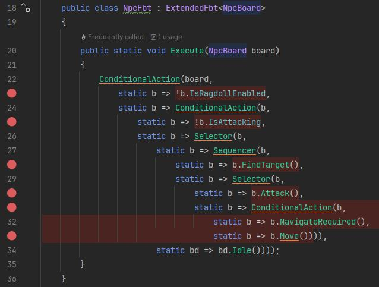

# Functional Behavior Tree in C#

Highly efficient, functional-style implementation of behavior tree in C# designed to enable clear AI logic, convenient debugging, and fast execution with zero memory allocation.

The codebase is minimal, simple, and easy to understand. Once familiarized with the approach, you can quickly reproduce or adapt it.  
Rather than a library, this solution is better described as a design pattern.

The implementation has no strict dependency on Unity and can be integrated into any C# project.

# Overview

## Intro

There are many different implementations of Behaviour Tree in Unity. Typically, it's some kind of node editor, a large set of nodes, a kind of debugging tools, and a lot of internal service code whose efficiency we can only guess at. Debugging is often a big problem.

**Functional Behavior Tree is a programming pattern that offers a different, professional approach**.

- Instead of a node editor, you define the behavior tree inside C# using simplest and clear syntax.
- Instead of a using heavy libraries with ton of internal code, you use a thin simple pattern that is absolutely transparent for you.
- Instead of a specialized debugger, you use C# debugger inside you favorite IDE.

This package includes the full source code of Functional Behavior Tree (FBT) parrern in C# and the example of using. You can use FBT it as a black box to create AI for your NPC, or you can improve it yourself by adding your nodes.

## Key Features

1. **Clear and Concise Behavior Tree Definition**  
   Behavior trees are defined directly in code using functions calls and lambda expressions, resulting in clear and compact logic.   

2. **Ease of Debugging**  
   The tree definition and execution code are the same, which means you can place breakpoints inside any anonymous delegate, and they will work correctly.  
   No special complex "behaviour tree debugger" is required, you will use your favorite C# IDE.

3. **Zero memory allocation**  
   No memory is allocated for the tree structure because it is embedded directly into the code.  
   No memory is allocated for delegate instances, thanks to the use of static anonymous delegates.  
   No memory is allocated for transferring parameters to functions due to the use of 'params Collection' arguments (in C# 13) or functions with predefined argument sets (in earlier versions of C#) instead of 'params arrays'.

4. **High speed**  
   The implementation relies solely on function invocations, static delegates, conditional expressions, and loops.  
   No expensive features are used (e.g., garbage collection, hash tables, closures, etc.).
  
5. **Minimal and highly readable code**  
   The simplest version of the library, containing only classic nodes, is just a single .cs file with several tens lines (excluding comments).

## Installation

1. Create a Unity project (Unity 2021.2 or later is required).
2. Install **Functional Behavior Tree**:
   - **Option 1:** Install the package "Functional Behavior Tree" from the Unity Asset Store.
   - **Option 2:** Clone the Git repository [FunctionalBT](https://github.com/dmitrybaltin/FunctionalBT.git) to a subfolder inside the **Assets** directory of your project.  

## Usage Example

Detailed examples of using Functional Behavior Tree (FBT) can be found in the folder examples/example1. To run the example, open the scene file located at examples/example1/Scene.unity in Unity.

This example demonstrates a simple behavior tree for an NPC represented as a circle. The NPC can idle, move toward the player (also represented as a circle), or attack the player, depending on specific conditions.

```csharp
public class NpcFbt : ExtendedFbt<NpcBoard>
{
    public static void Execute(NpcBoard b)
    {
        ConditionalAction(b,
            static b => !b.IsRagdollEnabled,
            static b => ConditionalAction(b,
                static b => !b.IsAttacking,
                static b => Selector(b,
                    static b => Sequencer(b, 
                        static b => b.FindTarget(),
                        static b => Selector(b,
                            static b => b.Attack(), 
                            static b => ConditionalAction(b,
                                static b => b.NavigateRequired(),
                                static b => b.Move()))),
                    static bd => bd.Idle())));
    }
}
```
Key points to note:  
1. **Classes**
   1. **NpcBoard** is a custom **blackboard** class created by the user that contains the data and methods related to the NPC, which are controlled by the NpcFbt behavior tree.
   1. **NpcFbt** is a custom class responsible for implementing the AI logic for this NPC. It contains only one static function Execute() and does not contain any data fields.
   1. **NpcBoard** instance is stored in an external container (e.g., a MonoBehaviour in Unity), which calls **NpcBoard.Execute()** during the update cycle.
   1. **ExtendedFbt** is a class of this library implementing the code of nodes.
1. **Methods**
   1. **Action()**, **Sequencer()**, **Selector()**, and **ConditionalAction()** are static methods of the ExtendedFbt class from this library, implementing different nodes.
   1. **b.FindTarget()**, **b.Attack()**, **b.Move()**, and **b.Idle()** are defined by the user inside NpcBoard class.
1. **Zero memory allocation**
   1. **static** modifier before anonymous delegates guarantee avoiding closures, therefore no memory allocation required for every delegates call.
      1. Every lambda function uses the only a single internal variable, **b**, and there are no closures here.
      2. All all these **b** variables point to the same **NpcBoard** instance received as an argument, but they are independent variables.
      3. Every tree node function receives the blackboard as a first parameter and forwards it to child nodes through delegates.
      4. Any accidental reference to a variable from a different lambda function would create a closure, causing memory allocation, but the **static** modifier prevents such situations.
   1. Functions with multiple arguments (**Selector**, **Sequence**, etc) avoid using **params arrays** definition that's why no memory allocated for these calls.

As shown in the example code, this implementation is extremely simple, zero allocation and fast and focused purely on logic, making it easy to debug. You can set breakpoints on any anonymous delegate or tree node function. When the execution reaches these breakpoints, the debugger will pause correctly, allowing you to inspect the state at that point.
Here is an illustration of breakpoints in the code:


## Functional Behavior Tree pattern code for C#13 (not for Unity)

Below is a full implementation of the Functional Behavior Tree pattern, including all the classic nodes (**Selector**, **Sequencer**, **Conditional**, and **Inverter**) and the required supporting code: the **Status** enum and a couple of extension methods for it.  
In total, the code is just over 100 lines, including comments.  
You can also find the same code in the file [LightestFBT.cs](src/LightestFBT.cs).

The main point here is an **each node is a static function rather than an object**. That's why the code is minimal and contains the core logic only:
1. Every node - is the only static function, containing the required logic.
1. Different boilerplate services code (for example class constructior) is not required. 
1. No code for **Action** node is required because an every static delegates **Func<T, Status>** can be used as an **Action** node.

The provided **Selector()** code utilizes a C# 13 feature — **params collections** — to pass multiple input arguments using **ReadOnlySpan** instead of a traditional **params array**.  
This approach completely avoids dynamic memory allocation calling this function. For more details, see the official documentation on [params collections](https://learn.microsoft.com/en-us/dotnet/csharp/language-reference/proposals/csharp-13.0/params-collections).

```csharp
    public enum Status
    {
        Success = 0,
        Failure = 1,
        Running = 2,
    }

    public static class StatusExtensions
    {
        /// <summary>
        /// Invert Status
        /// </summary>
        /// <param name="status">Source status to invert</param>
        /// <returns></returns>
        [MethodImpl(MethodImplOptions.AggressiveInlining)]
        public static Status Invert(this Status status)
        {
            return status switch
            {
                Status.Failure => Status.Success,
                Status.Success => Status.Failure,
                _ => Status.Running,
            };
        }

        [MethodImpl(MethodImplOptions.AggressiveInlining)]
        public static Status ToStatus(this bool value) => 
            value ? Status.Success : Status.Failure;
    }
    
    public class LightestFbt<T>
    {
        /// <summary>
        /// Classic inverter node
        /// </summary>
        /// <param name="board">Blackboard object</param>
        /// <param name="func">Delegate receiving T and returning Status</param>
        /// <returns></returns>
        [MethodImpl(MethodImplOptions.AggressiveInlining)]
        public static Status Inverter(T board, Func<T, Status> func)
            => func.Invoke(board).Invert();
        
        /// <summary>
        /// Execute the given func delegate if the given condition is true 
        /// </summary>
        /// <param name="board">Blackboard object</param>
        /// <param name="condition">Condition given as a delegate returning true</param>
        /// <param name="func">Action to execute if condition is true. Delegates receiving T and returning Status</param>
        /// <returns></returns>
        [MethodImpl(MethodImplOptions.AggressiveInlining)]
        public static Status If(T board, Func<T, bool> condition, Func<T, Status> func) 
            => condition.Invoke(board) ? func.Invoke(board): Status.Failure;

#if NET9_0_OR_GREATER
        /// <summary>
        /// Classic selector node
        /// </summary>
        /// <param name="board">Blackboard object</param>
        /// <param name="funcs">Actions returning Status</param>
        /// <returns></returns>
        [MethodImpl(MethodImplOptions.AggressiveInlining)]
        public static Status Selector(T board, 
            params ReadOnlySpan<Func<T, Status>> funcs
            )
        {
            foreach (var f in funcs)
            {
                var childStatus = f?.Invoke(board) ?? Status.Failure;
                if(childStatus is Status.Running or Status.Success) 
                    return childStatus;
            }
            return Status.Failure;
        }

        /// <summary>
        /// Classic sequencer node
        /// </summary>
        /// <param name="board">Blackboard object</param>
        /// <param name="funcs">Delegates receiving T and returning Status</param>
        /// <returns></returns>
        [MethodImpl(MethodImplOptions.AggressiveInlining)]
        public static Status Sequencer(T board, 
            params ReadOnlySpan<Func<T, Status>> funcs
            )
        {
            foreach (var f in funcs)
            {
                var childStatus = f?.Invoke(board) ?? Status.Success;
                if (childStatus is Status.Running or Status.Failure)
                    return childStatus;
            }

            return Status.Success;
        }
#endif
   }
```
## Functional Behavior Tree pattern code for Unity

Unity does not support C# 13, so this library also includes the code compatible with Unity (2021.2 and later).
These implementations are slightly more verbose but remain simple, clear, and allocation-free.   

The only required change is chanfing paramas Copllection (usied in Sequencer and Selector) to some other code.
You can see the implementation bellow.

```csharp
#if !NET9_0_OR_GREATER
        /// <summary>
        /// Classic selector node
        /// </summary>
        [MethodImpl(MethodImplOptions.AggressiveInlining)]
        public static Status Selector(T board,
            Func<T, Status> f1,
            Func<T, Status> f2,
            Func<T, Status> f3 = null,
            Func<T, Status> f4 = null,
            Func<T, Status> f5 = null,
            Func<T, Status> f6 = null,
            Func<T, Status> f7 = null,
            Func<T, Status> f8 = null)
        {
            var s = f1?.Invoke(board) ?? Status.Failure; if (s is Status.Running or Status.Success) return s;
            s = f2?.Invoke(board) ?? Status.Failure; if (s is Status.Running or Status.Success) return s;
            s = f3?.Invoke(board) ?? Status.Failure; if (s is Status.Running or Status.Success) return s;
            s = f4?.Invoke(board) ?? Status.Failure; if (s is Status.Running or Status.Success) return s;
            s = f5?.Invoke(board) ?? Status.Failure; if (s is Status.Running or Status.Success) return s;
            s = f6?.Invoke(board) ?? Status.Failure; if (s is Status.Running or Status.Success) return s;
            s = f7?.Invoke(board) ?? Status.Failure; if (s is Status.Running or Status.Success) return s;
            s = f8?.Invoke(board) ?? Status.Failure; if (s is Status.Running or Status.Success) return s;

            return s;
        }
        
        /// <summary>
        /// Classic sequencer node
        /// </summary>
        /// <param name="board">Blackboard object</param>
        [MethodImpl(MethodImplOptions.AggressiveInlining)]
        public static Status Sequencer(T board,
            Func<T, Status> f1,
            Func<T, Status> f2,
            Func<T, Status> f3 = null,
            Func<T, Status> f4 = null,
            Func<T, Status> f5 = null,
            Func<T, Status> f6 = null,
            Func<T, Status> f7 = null,
            Func<T, Status> f8 = null)
        {
            var s = f1?.Invoke(board) ?? Status.Success; if (s is Status.Running or Status.Failure) return s;
            s = f2?.Invoke(board) ?? Status.Success; if (s is Status.Running or Status.Failure) return s;
            s = f3?.Invoke(board) ?? Status.Success; if (s is Status.Running or Status.Failure) return s;
            s = f4?.Invoke(board) ?? Status.Success; if (s is Status.Running or Status.Failure) return s;
            s = f5?.Invoke(board) ?? Status.Success; if (s is Status.Running or Status.Failure) return s;
            s = f6?.Invoke(board) ?? Status.Success; if (s is Status.Running or Status.Failure) return s;
            s = f7?.Invoke(board) ?? Status.Success; if (s is Status.Running or Status.Failure) return s;
            s = f8?.Invoke(board) ?? Status.Success; if (s is Status.Running or Status.Failure) return s;

            return s;
        }
#endif
```

The disadvantage of the chosen method is a limited maximum quantity of child nodes that is 8, but really it is not a significant minus.  
This number 8 was chosen out of practice, and is almost always enough for the behavior tree logic.  
If more child nodes are required, there are two simple solutions:
1. Place several nodes hierarchically on top of each other. Each additional "stage" of this pyramid increases the number of child nodes exponentially.
2. Modify the code of the **Sequencer** and **Selector** functions by adding more input arguments. ~10 minutes of coding.

### Note
No actions are required to switch between "*Unity mode*" and "*C#13 mode*" because this is handled automatically using preprocessor directives (`#if !NET9_0_OR_GREATER`) in the code. 
If C#13 is supported, it will be used automatically.

## Requirements
- C# 9 (Unity 2021.2 and later) is required because of using static anonymous delegates.

---
# Functional Behavior Tree Philosophy

This section explains the design philosophy, implementation details, and optimizations behind the Functional Behavior Tree (BT) library. It also highlights key constraints, the reasoning behind chosen approaches, and solutions to specific challenges.

## Initial Constraints

The library was designed with the following limitations in mind:

1. **Classic Behavior Tree Execution:**
   - Implements a traditional behavior tree that executes completely during each game loop cycle, rather than adopting an event-driven approach.

2. **Code-Only Implementation:**
   - Focuses solely on C# code, avoiding the need for visual editors (e.g., Behavior Designer) or custom languages (e.g., PandaBT).

3. **Separation of Concerns:**
   - The behavior tree and the managed object (commonly referred to as the Blackboard) are treated as separate entities. Nodes operate on the Blackboard shared across all nodes within the same tree instance.


## Behavior Trees: A Functional Approach

Many different implementations of Behaviour Trees in Unity involve a node editor, a large set of nodes, a runtime system, and debugging tools, along with a lot of internal service code whose efficiency is often uncertain. However, most of these implementations treat the tree as a graph, which leads to unnecessarily complex designs, where nodes are represented as objects requiring individual classes and intricate visual editors. As a result, debugging becomes challenging due to the separation of node creation and execution across various parts of the codebase, making specialized tools necessary.

### The Functional Alternative

To truly understand the Behaviour Tree, we should think of it as a function, not a graph.

Indeed, each node in the BT is a function (not an object!), with multiple inputs and a single output, and it doesn’t require memory (there is no need to store any state between function calls). Therefore, the tree as a whole, or any of its subtrees, is also a function that calls the functions of its child nodes.

In this library:

- **Nodes are functions, not objects:**
  - Each node is a function with multiple inputs and one output, avoiding the need for memory allocation.

- **Tree as a recursive function:**
  - The behavior tree is a recursive function that calls nested node functions.

- **Simplified debugging:**
  - Functional programming principles ensure clarity, making code easy to debug using standard IDE tools.

This approach results in clean, readable, and efficient code with minimal boilerplate, all while being fast and memory-efficient.

---

## Achieving Zero Memory Allocation

### The Problem

Below is the code from an earlier version of the pattern:

```csharp
    public class MyLaconicFunctionalBt : LaconicFunctionalBt <ActorBoard>
    {
        public MyLaconicFunctionalBt(ActorBoard board) : base(board) { }
        
        public Status Execute()
        {
            return
                Selector(
                    _ => Action(
                        _ => SetColor(Color.grey)),
                    _ => Action(
                        _ => SetColor(Color.red)));
        }

        Status SetColor(Color color)
        {
            Board.View.SetColor(color);
            return Status.Failure;
        }
    }
```

It works not so bad but unfortunatelly allocated significant memory due to:

1. **Anonymous Delegates:**
   - Each delegate implicitly captured the `this` pointer, creating new `System.Delegate` objects on every execution.

2. **Dynamic Arrays:**
   - Functions like `Sequencer` and `Selector` used `params`, leading to heap-allocated arrays for each call.

Memory allocation during each game loop cycle, especially for large scenes with many NPCs, caused performance bottlenecks.

### Solutions

I eventually switched to the following implementation:

```csharp
    public class MyLaconicFunctionalBt : LaconicFunctionalBt <ActorBoard>
    {
        public static Status Execute(ActorBoard b)
        {
            return
                Selector(
                    b => b.SetColor(Color.grey),
                    b => b.SetColor(Color.red));
        }
    }
    public class
    {
        Status SetColor(Color color)
        {
            View.SetColor(color);
            return Status.Failure;
        }
    }
```

#### 1. Static Anonymous Functions

Using static anonymous functions (introduced in C# 9) resolves delegate memory allocation issues. Key adjustments include:

- **Static Delegates:**
  - Node functions (e.g., `Sequencer`, `Selector`) are declared as static.

- **Shared Blackboard Variable:**
  - The blackboard is passed explicitly as an argument, allowing consistent naming (e.g., `b`) without capturing external variables.

Here is a perfect article about static anonimous delegates and their efficiency [Understanding the cost of C# delegates](https://devblogs.microsoft.com/dotnet/understanding-the-cost-of-csharp-delegates/)

#### 2. Handling `params` Arrays

Dynamic memory allocation for `params` was addressed by:

1. **ReadOnlySpan (C# 13):**
   - Uses stack-allocated collections instead of heap-allocated arrays. Example:
     ```csharp
     public Status Sequencer(ReadOnlySpan<Func<T, Status>> funcs)
     ```

   Unfortunately, C# 13 features are not yet supported in Unity.

2. **Fixed Parameter Overloads:**
   - Introduced functions with fixed parameter counts:
     ```csharp
     public Status Sequencer(Func<T, Status> func1, Func<T, Status>? func2 = null, ...)
     ```

   - Practical limit of 5 parameters to cover typical scenarios.

3. **Auto-Generated Functions:**
   - For advanced use cases, additional overloads (e.g., for up to 20 parameters) can be generated to optimize performance further.

## Conclusion

The Functional Behavior Tree library provides a streamlined, efficient, and modern solution to behavior tree implementation. By leveraging functional programming principles, memory optimizations, and modern C# features, it delivers:

- Simple and effective debugging.
- Zero runtime memory allocation.
- Clean and readable syntax.

While some compromises were necessary for compatibility, the overall design remains robust and aligns closely with the original vision.
