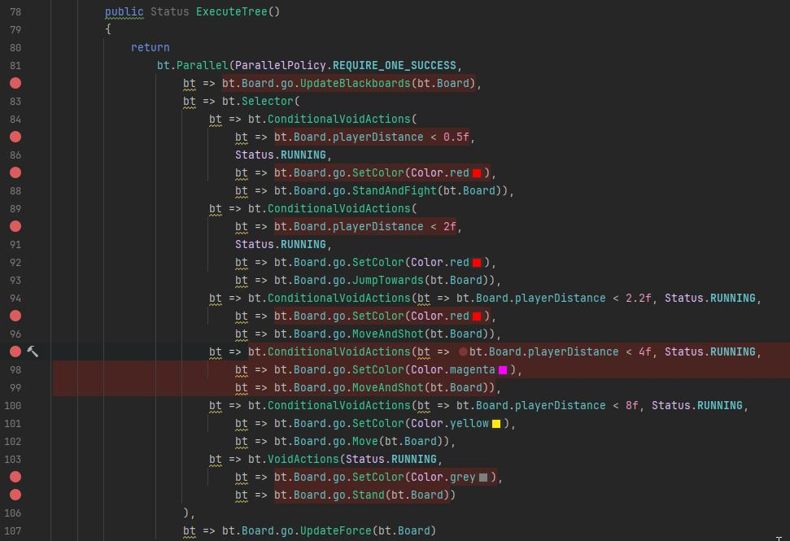

# Functional Behavior Tree in C#

This project provides a high effitient functional-style implementation of a behavior tree, designed for clear AI logic, convenient debugging and extremally fast execution with zero memory allocation.

## Key Features

1. **Concise Tree Definition**  
   Behavior trees are defined directly in code using functions calls and lambda expressions, resulting in clear and compact logic.   

3. **Ease of Debugging**  
   Сode is easy to debug — the tree definition and execution code are the same, which means you can place breakpoints inside any anonymous delegate, and they will work correctly.  
   No special complex "behaviour tree debugger" is required, you will use your favorite C# IDE.

3. **Zero memory allocation**  
   - No memory is allocated for the tree structure because it is embedded directly into the code.
   - No memory is allocated for delegate instances, thanks to the use of static anonymous delegates.
   - No memory is allocated for transferring parameters to functions due to the use of ReadonlySpan arguments (in C# 13) or functions with predefined argument sets (in earlier versions of C#).
   - The only allocated field within the BT instance is a reference to the blackboard object.

4. **High speed**  
   - The implementation relies solely on function invocations, static delegates, conditional expressions, and loops.
   - No expensive features are used (e.g., garbage collection, hash tables, closures, etc.).

## Usage Example

Detailed example is inside the file 'FunctionalBehave.cs'. 
Here’s a core of it, the tree definition.

static modifier before anonimous delegates garantee avoiding closures, making it extremally efficient in terms of memory usage.
Function with multiple arguments (Selector, Sequence, etc ) avoids using "parans arrays" definition thats why noa momery allocated for these calls.

As you can see bellow this code is easy to debug — you can place breakpoints inside any anonymous delegate, and they will work correctly.

```csharp
using System;
using System.Collections.Generic;
using System.Diagnostics;
using FunctionlBT;
using UnityEngine;

namespace FunctionalBtTest
{
    //...

    public class FunctionalBehave : MonoBehaviour
    {
        //...

        public Status ExecuteTree()
        {
            return
                bt.Parallel(bt, ParallelPolicy.REQUIRE_ONE_SUCCESS,
                    bt => bt.Board.go.UpdateBlackboards(bt.Board),
                    bt => bt.Selector(
                        bt => ConditionalVoidActions(
                            bt => bt.Board.playerDistance < 0.5f,
                            Status.RUNNING,
                            bt => bt.Board.go.SetColor(Color.red),
                            bt => bt.Board.go.StandAndFight(bt.Board)),
                        bt => bt.ConditionalVoidActions(bt => bt.Board.playerDistance < 2f, Status.RUNNING, 
                            bt => bt.Board.go.SetColor(Color.red),
                            bt => bt.Board.go.JumpTowards(bt.Board)),
                        bt => bt.ConditionalVoidActions(bt => bt.Board.playerDistance < 2.2f, Status.RUNNING, 
                            bt => bt.Board.go.SetColor(Color.red),
                            bt => bt.Board.go.MoveAndShot(bt.Board)),
                        bt => bt.ConditionalVoidActions(bt => bt.Board.playerDistance < 4f, Status.RUNNING, 
                            bt => bt.Board.go.SetColor(Color.magenta),
                            bt => bt.Board.go.MoveAndShot(bt.Board)),
                        bt => bt.ConditionalVoidActions(bt => bt.Board.playerDistance < 8f, Status.RUNNING, 
                            bt => bt.Board.go.SetColor(Color.yellow),
                            bt => bt.Board.go.Move(bt.Board)),
                        bt => bt.VoidActions(Status.RUNNING, 
                            bt => bt.Board.go.SetColor(Color.grey),
                            bt => bt.Board.go.Stand(bt.Board))
                    ),
                    bt => bt.Board.go.UpdateForce(bt.Board)
                );
        }
    }
}
        //...
```



---

## Notes on Memory Usage

This approach utilizes anonymous delegates, which may incur memory overhead, especially when closures are involved.  
However, whether anonymous delegates cause memory traffic depends on the platform and runtime, which remains an open question.

### Requirements

- **.NET Version**: .NET 5 or higher recommended.
